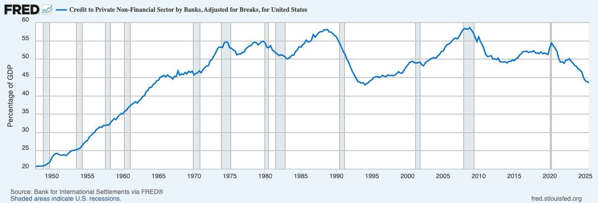
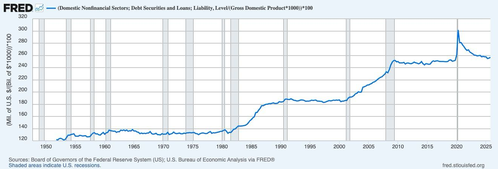
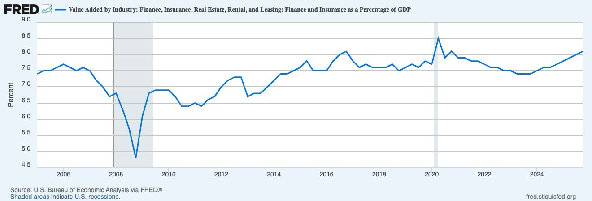

# Financial Centrality and Systemic Fragility

## General Overview

This project aims to examine how the increasing importance of (and reliance on) credit, debt, and financial intermediation may influence macroeconomic stability within the United States.

The central objective here is to study financial centrality as a measurable economic phenomenon. In this project, financial centrality refers to the extent to which households, firms, and aggregate economic activity depend on key financial institutions, credit markets, debt financing, and continued access to refinancing.

The project aims to adequately combine classical economic theory, historical analysis, and macroeconomic data in order to develop an initial research paper, transformed into a reproducible data analysis project using publicly available economic data.

## Research Question

How has the growing role of credit and financial intermediation affected the structure and stability of the U.S. economy?

Supporting questions include:

- Has private sector credit increased relative to total economic output?
- How has total non-financial debt changed relative to the GDP?
- How and why has finance become a more economically significant industry?
- Can changes in leverage and refinancing dependence help explain periods of financial instability?

## Economic Motivation

Modern financial institutions perform essential economic functions, including:

- Transforming short term deposits into longer-term loans
- Providing liquidity and payment services
- Allocating credit among households and firms
- Financing consumption, investment, and business expansion
- Transmitting monetary and financial conditions throughout the economy

These functions can also produce devastating and deeply embedded systemic vulnerabilities.

Banks and other intermediaries frequently hold relatively illiquid assets while maintaining liabilities that may need to be repaid on shorter notice. High leverage and dependence on refinancing can further amplify economic contractions when credit conditions deteriorate.

This project aims to study these mechanisms through three principal theoretical perspectives:

1. Diamond and Dybvig model : maturity transformation, liquidity provision, and bank-run risk
2. **Hyman Minsky:** leverage cycles, refinancing dependence, and endogenous financial instability
3. **Ben Bernanke:** the role of disrupted financial intermediation in propagating economic downturns


In addition, this project will:

- Collect macroeconomic and financial data from FRED and related public sources
- Reproduce selected financial indicators programmatically
- Examine long run movements in credit, debt, and financial sector activity
- Compare financial indicators across expansionary and recessionary periods
- Calculate summary statistics and rates of change
- Evaluate relationships between leverage, financial sector growth, and macroeconomic instability
- Present emerical findings through clear and reproducible data visualizations

## Initial Data Visualizations

The following figures provide the starting point for the project's empirical analysis. These visualizations were initially produced using Federal Reserve Economic Data (FRED). Later stages of the project will retrieve the underlying observations directly and reproduce the figures programmatically in Python.

### Bank Credit to the Private Nonfinancial Sector



This figure shows bank credit to the U.S. private nonfinancial sector as a percentage of GDP. It provides a broad measure of the extent to which households and firms depend on bank-provided credit relative to total economic output.

The long-run series shows substantial growth in bank credit relative to GDP during several periods of economic expansion, alongside significant adjustments around major downturns. Rather than establishing a causal relationship between credit growth and recessions, the series provides a starting point for examining how credit dependence and leverage evolve across the business cycle.

**FRED Series:** `QUSPBM770A`

---

### Domestic Nonfinancial Debt Relative to GDP



This figure measures domestic nonfinancial debt relative to U.S. GDP. Unlike the previous indicator, which focuses specifically on bank credit, this measure captures a broader portion of the debt structure surrounding households, firms, and other nonfinancial economic activity.

The series displays a substantial long-run increase in debt relative to economic output. This makes it useful for examining changes in aggregate leverage and the growing role of debt financing within the U.S. economy.

**FRED Series:** `TCMDODNS`  
**GDP Series:** `GDP`

---

### Finance and Insurance as a Share of GDP



This figure shows finance and insurance value added as a percentage of U.S. GDP. It provides an initial measure of the financial sector's economic weight relative to the broader economy.

The series remains a significant component of U.S. output across both expansions and downturns, while also displaying noticeable changes around major economic disruptions such as the 2007–2009 financial crisis and the 2020 recession.

This indicator does not directly measure financial concentration or systemic risk. Instead, it provides context for evaluating the broader economic importance of financial intermediation.

**FRED Series:** `VAPGDPFI`

## Planned Methodology

The quantitative portion of the project will be completed primarily using Python(subject to change with additions).

Planned tools include:

- `pandas` for data cleaning and time series manipulation
- `matplotlib` for visualization
- `fredapi` or direct FRED CSV downloads for data collection
- `numpy` for numerical operations
- Jupyter notebooks for exploratory analysis
- Python scripts for graph generation


Any statistical relationships will obviously be interpreted cautiously, as any correlation between financial indicators and recessions do not mean causation

## Historical Context

The quantitative analysis will be supplemented by selected historical cases.

One initial case is the Panic of 1907, which demonstrates how liquidity shortages and institutional interconnectedness can transmit a localized disturbance throughout a larger financial system.

Additional comparative material may include:

- The Great Depression
- The 2007–2009 financial crisis
- Cooperative financial institutions
- Mandragoon Operatives
- Alternative bank ownership and governance structures

These cases will be used to place the data in historical and institutional context rather than to substitute for quantitative evidence.

## Data Sources

The project will primarily use public data from:

- Federal Reserve Economic Data (FRED)
- Board of Governors of the Federal Reserve System
- U.S. Bureau of Economic Analysis
- Bank for International Settlements
- National Bureau of Economic Research recession dates

Exact series definitions, units, transformations, and download dates will be documented as the dataset is constructed.

## Repository Structure

The planned repository structure is:

```text
financial-centrality-analysis/
├── README.md
├── data/
│   ├── raw/
│   └── processed/
├── figures/
│   ├── original/
│   └── generated/
├── notebooks/
├── src/
├── paper/
└── requirements.txt
```

- `data/raw/` will contain original downloaded data.
- `data/processed/` will contain cleaned and transformed datasets.
- `figures/original/` will contain the initial FRED visualizations.
- `figures/generated/` will contain visualizations created through code.
- `notebooks/` will contain exploratory economic analysis.
- `src/` will contain reusable Python scripts.
- `paper/` will contain the written research component.


Completed:

- Initial literature review
- Identification of the main economic mechanisms
- Selection of preliminary FRED indicators
- Initial written analysis of credit, leverage, and financial intermediation
- Initial historical research

In progress:

- Repository organization
- Uploading and documenting the original figures
- Collecting source data
- Creating reproducible visualizations
- Developing the empirical methodology

## Limitations

The selected variables are broad macroeconomic indicators and do not provide complete measures of financial concentration or systemic risk.

Several key limitations will be considered:

- The indicators come from different sources and frequencies.
- Definitions and measurement methods may change across time.
- Debt to GDP ratios can rise because debt increases, GDP decreases, or both.
- Recession shading does not prove that financial variables caused a recession.
- Financial sector value added is not identical to financial power, concentration, or risk.
- Historical comparisons may be affected by changes in regulation and financial institutions.


## Author

Muhammad Arij

Computer Science and Economics  
Macalester College

## Project Notice

This is an independent academic and portfolio project. It is only intended for economic research, data analysis, and educational purposes. The project does not provide proper financial or investment advice for day to day business. 

